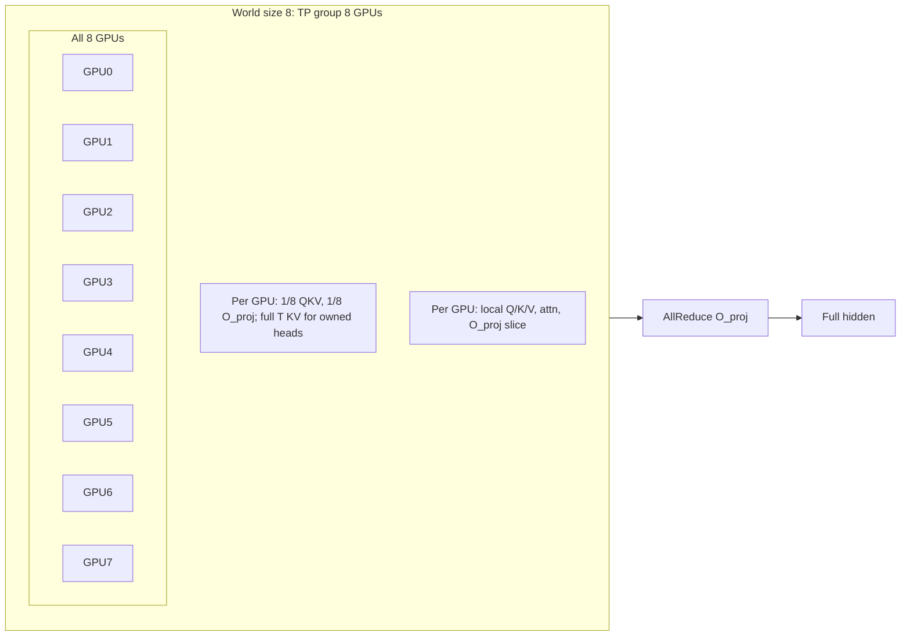
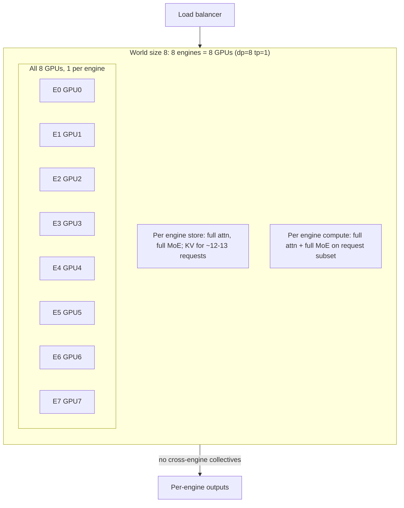
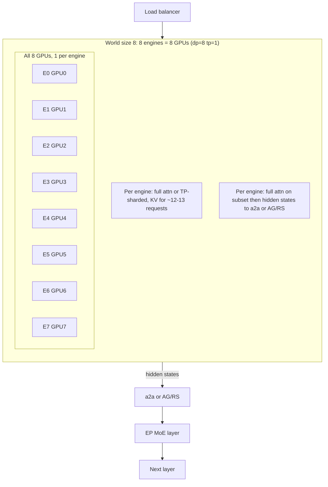
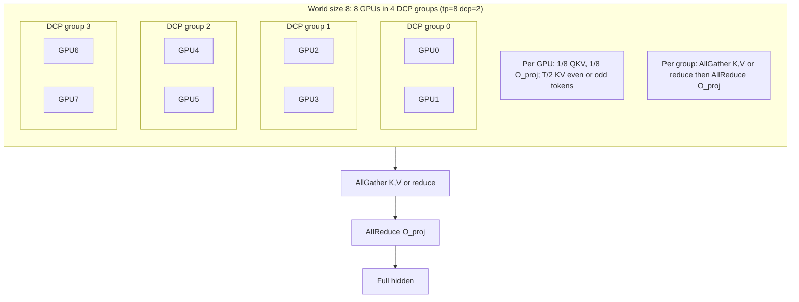

# Attention Sharding: TP, DP, and DCP for Qwen3-235B-A22B (World Size 8)

**Scope:** This document explains how attention math, per-GPU storage, and communication differ across **Tensor Parallel (TP)**, **Pure DP**, **DP Attention (DP+EP)**, and **Decode Context Parallel (DCP)** deployments when serving 100 requests with varying query lengths and KV cache lengths on **world size 8**. Model: **Qwen3-235B-A22B** with **4 KV heads** (GQA).

---

## References

- [Data Parallel Deployment](https://docs.vllm.ai/en/latest/serving/data_parallel_deployment/) — DP: replicated attention per rank, independent KV caches, load balancing.
- [Context Parallel Deployment](https://docs.vllm.ai/en/latest/serving/context_parallel_deployment/) — DCP: KV cache sharded along sequence dimension `T`; `dcp_size in [1, tp_size/H]`; interleaving for growing cache.

**DP architecture (vLLM):** Each DP rank is a separate **core engine** process. The front-end (API server) talks to engines over **ZMQ sockets**. When DP is combined with TP, each DP engine **owns TP per-GPU worker processes** — so total GPUs = `dp_size × tp_size` (e.g. dp=4, tp=2 ⇒ 4 engines, each with 2 workers = 8 GPUs). Attention and KV cache are per engine; within an engine, TP workers do tensor-parallel collectives (e.g. all-reduce after O_proj). **Pure DP:** No EP; each engine = full model replica (or TP group); **no** cross-engine collectives; ZMQ + request split only. **DP Attention (DP+EP):** Use `--enable-expert-parallel`; attention replicated per rank; MoE experts sharded across EP = DP×TP; **a2a or AG/RS** to move hidden states to/from expert shards for the following layers.

**Code:** `QKVParallelLinear` / `RowParallelLinear` ([vllm/model_executor/layers/linear.py](../../pm-vllm/vllm/model_executor/layers/linear.py)), `get_dcp_local_seq_lens` ([vllm/v1/attention/backends/utils.py](../../pm-vllm/vllm/v1/attention/backends/utils.py)), DCP groups ([vllm/distributed/parallel_state.py](../../pm-vllm/vllm/distributed/parallel_state.py)).

---

## Model and Deployment Variants (World Size 8)

**Model:** Qwen3-235B-A22B — 4 KV heads (H=4), GQA. For `tp=8`, KV cache duplication without DCP is `tp_size / H = 2`; adding `dcp=2` removes it.

| Deployment | Config | Description |
|------------|--------|-------------|
| **TP-only** | `tp=8`, `dp=1`, `dcp=1` | Single engine; 8 GPUs as one TP group. |
| **Pure DP** | `tp=1`, `dp=8` or `tp=2`, `dp=4`; **no** `--enable-expert-parallel` | One core engine per DP rank; full model replica per engine (or TP within engine); independent KV cache; request split; **no** cross-engine collectives. |
| **DP Attention (DP+EP)** | `tp=1`, `dp=8` (or `tp=2`, `dp=4`) **with** `--enable-expert-parallel` | Attention replicated per engine; MoE experts sharded across EP = DP×TP; **a2a or AG/RS** so hidden states reach expert shards and next layers. |
| **DCP** | `tp=8`, `dcp=2` | Same 8 GPUs; KV cache sharded along `T`; `dcp_size ≤ tp_size/H = 2`. |

### World size and minimum GPUs

Total **world size** (number of GPUs) and how it changes with config:

| Deployment | World size formula | Minimum world size | Notes |
|------------|--------------------|--------------------|-------|
| **TP-only** | `world_size = tp_size` | **1** (no TP); **2** if TP is used | Single engine; all GPUs in one TP group. |
| **Pure DP** | `world_size = dp_size × tp_size` | **2** (e.g. dp=2, tp=1) | At least 2 engines for request split; each engine can have tp=1 or more. |
| **DP Attention (DP+EP)** | `world_size = dp_size × tp_size = EP size` | **2** (e.g. dp=2, tp=1) | EP shards experts across all ranks; need at least 2 for EP. |
| **DCP** | `world_size = tp_size` (DCP does not add GPUs) | **tp_size** with `dcp_size ≥ 2` and `dcp_size ≤ tp_size/H` | For Qwen3 (H=4), dcp=2 requires tp_size ≥ 8. So minimum 8 GPUs to use DCP with dcp=2. |

- **Scaling:** Increasing TP increases world size (more GPUs per engine). Increasing DP increases world size (more engines). DCP keeps world size fixed; it only reuses the same TP GPUs to shard KV along the sequence dimension.
- **Same 8 GPUs:** TP-only (tp=8), Pure DP (e.g. dp=8 tp=1 or dp=4 tp=2), DP Attention (e.g. dp=8 tp=1 or dp=4 tp=2 with EP), and DCP (tp=8, dcp=2) all use 8 GPUs but with different partitioning.

---

## TP-Only (tp=8, dp=1, dcp=1)

### Stored per GPU
- **Weights:** 1/8 of QKV (column slice along head dimension), 1/8 of O_proj (row slice). With H=4 and tp=8, each rank gets 1 KV head (or replicated if tp > H; for Qwen3-235B, 4 KV heads ⇒ 2-way replication per head across 8 GPUs).
- **KV cache:** Full sequence length `T` for the heads this rank owns (e.g. 2 heads per GPU when tp=8, H=4 → 2 replicas of the 4 heads).

### Computed per GPU
- Local Q/K/V from column-parallel QKV_proj (no gather).
- Local attention over this rank’s heads and full `T`.
- Local O_proj output slice; then **all-reduce** across TP group so every GPU has the full attention output.

### Combine operators
- **All-reduce** after O_proj (RowParallelLinear with `reduce_results=True`).

### Communications
- One **all-reduce** per layer after attention O_proj (and after MoE down_proj when experts are TP-sharded).

---

## Pure DP (e.g. dp=8, no EP)

**Setup:** One **core engine process** per DP rank; front-end routes requests to engines via **ZMQ**. With world size 8: either 8 engines × 1 GPU (tp=1, dp=8) or 4 engines × 2 GPUs (tp=2, dp=4). **No** `--enable-expert-parallel`. Each engine holds a **full** model replica (or TP-sharded only within that engine). MoE = full replica per engine (or TP across the engine’s workers only). **No** cross-engine collectives.

### Stored per GPU (per engine)
- **Weights:** Full attention weights when tp=1; when tp>1, TP-sharded weights within engine. Full MoE replica per engine (or TP-sharded within engine).
- **KV cache:** Independent **per engine**; each engine stores KV only for the requests it is scheduled (e.g. ~12–13 of 100 for dp=8).

### Computed per GPU
- Each **engine** runs **full** attention and **full** MoE on its **request subset**. No cross-engine computation.

### Combine operators
- **None** across engines. Within engine: when tp>1, **all-reduce** after O_proj and after MoE down_proj.

### Communications
- **Front-end ↔ engines:** ZMQ (request routing, responses). **Across DP ranks:** **no** collectives. Within engine: when tp>1, same as TP (all-reduce after O_proj and MoE down_proj).

---

## DP Attention (DP+EP) (e.g. dp=8 with --enable-expert-parallel)

This section is for **DP + Expert Parallel (EP)** only; for DP without EP, see **Pure DP** above.

**Setup:** **With** `--enable-expert-parallel`. One core engine per DP rank; ZMQ to front-end. With world size 8: either 8 engines × 1 GPU (tp=1, dp=8) or 4 engines × 2 GPUs (tp=2, dp=4). Attention replicated per DP rank; MoE experts sharded across **EP = DP×TP**. Hidden states must be sent across ranks via **a2a or AG/RS** so that expert shards (and the following layers) receive the right inputs.

### Stored per GPU (per engine)
- **Weights:** Full attention weights when tp=1; when tp>1, each engine’s workers hold TP-sharded weights (1/tp_size of QKV and O per GPU).
- **KV cache:** Independent **per engine**; each engine stores KV only for the requests it is scheduled (e.g. ~12–13 of 100 for dp=8).

### Computed per GPU
- Each **engine** runs full attention on its **subset of requests**. Within an engine, if tp>1, workers compute local Q/K/V and attention over their head slice, then all-reduce after O_proj (same as TP-only within that engine).
- No cross-engine computation **for attention**; each engine produces full hidden states for its requests. Those hidden states must then be **transmitted across ranks** (a2a or AG/RS) so that **EP MoE layers** (experts sharded across EP = DP×TP) can consume them and produce outputs for the following layers.

### Combine operators
- **Within each engine:** when tp>1, **all-reduce** after O_proj (and after MoE down_proj when MoE is TP rather than EP).
- **Across DP ranks (when using EP MoE):** **all-to-all (a2a)** or **AllGather / ReduceScatter (AG/RS)** so that hidden states from each rank reach the expert shards that need them, and expert outputs are gathered back. This is required for the EP MoE layers that follow attention (and for MoE → attention → MoE flow: MoE output also needs a2a/AG/RS to feed the next layer’s attention on the right ranks).

### Communications
- **Front-end ↔ engines:** ZMQ (request routing, responses).
- **Across DP ranks:** **No** collectives for attention. **When EP MoE is used:** **a2a** or **AG/RS** to send hidden states to the EP group and to receive expert outputs — so that hidden states for the following EP MoE layers (and the next attention layer) are available on the right ranks. DP coordinator for MoE sync (dummy forwards, etc.) as needed.
- **Within each engine:** when tp>1, same as TP (all-reduce after O_proj and, if MoE is TP, after MoE down_proj).

---

## DCP — Decode Context Parallel (tp=8, dcp=2)

### Stored per GPU
- **Weights:** Same as TP-only (1/8 QKV, 1/8 O_proj).
- **KV cache:** Sharded along **sequence dimension T**. Each DCP rank holds a subset of the token indices (e.g. interleaved: rank 0 holds tokens 0,2,4,..., rank 1 holds 1,3,5,...). So each GPU holds roughly `T/dcp_size` KV entries per head (and `dcp_size=2` ⇒ half of T per GPU).

### Computed per GPU
- Local Q/K/V as in TP.
- **Partial** attention: each rank has only a slice of K,V over T. To get full attention output, ranks must either (a) all-gather K,V so each rank has full K,V then run local attention, or (b) compute partial attention and then reduce. vLLM uses interleaving so that new tokens can be assigned to the correct DCP rank; combine step (all-gather or reduce) runs over the DCP group.

### Combine operators
- **All-gather** of K/V over DCP group (or equivalent) so each rank can compute full attention; or **reduce** of partial attention outputs. Exact pattern is backend-dependent (see [context_parallel_deployment](https://docs.vllm.ai/en/latest/serving/context_parallel_deployment/) and DCP code).

### Communications
- **DCP group:** all-gather or reduce over the 2 DCP ranks (dcp=2) per “slice” of the TP group. With tp=8, dcp=2: 4 DCP groups of size 2; within each group, KV or partial outputs are combined each decode step.
- Plus **all-reduce** after O_proj within TP (same as TP-only).

---

## End-to-End: MoE → Attention → MoE (with Norms/Residuals)

Layer order: **input → (norm) → MoE (gate + experts) → residual → (norm) → attention (QKV → attn → O) → residual → next layer.**

| Component | TP-only (tp=8) | Pure DP | DP Attention (DP+EP) | DCP (tp=8, dcp=2) |
|-----------|----------------|---------|----------------------|-------------------|
| **MoE** | Experts sharded across 8 GPUs; **all-reduce** on down_proj output. | Full replica per engine (or TP within engine); no cross-engine. | Experts sharded across EP = DP×TP; **a2a or AG/RS** to send/receive hidden states. | Same as TP on 8 GPUs; experts sharded by TP; **all-reduce** on down_proj. |
| **Attention** | Column-split QKV, row-split O; **all-reduce** after O_proj. | Replicated per engine (or TP within engine); no cross-engine. | Replicated per engine; after attention, **a2a or AG/RS** so EP MoE (and next layers) get hidden states. | KV cache T-sharded; **all-gather/reduce** over DCP group; then **all-reduce** after O_proj. |
| **Norms / residuals** | Local per GPU; no collectives. | Local per engine. | Local per engine. | Local per GPU; no extra collectives. |

---

## How Attention Math Changes (100 Requests, Varying Lengths)

| Deployment | Batch / request split | Attention formula | Per-GPU work | Collectives |
|------------|----------------------|-------------------|--------------|-------------|
| **TP** | One batch (up to 100 or scheduler limit) on 8 GPUs. | Same softmax(QK^T/√d)V; each GPU does 1/8 of heads. | 1/8 of head-dim work; full T per GPU for owned heads. | One **all-reduce** per layer (after O_proj; and after MoE down_proj). |
| **Pure DP** | 100 requests **split** across 8 engines (e.g. ~12–13 each). | Same formula **per engine** on its subset. | Each engine does full attention on smaller batch. | **None** across engines (within-engine all-reduce only when tp>1). |
| **DP Attention (DP+EP)** | Same request split across 8 engines. | Same formula **per engine** on its subset. | Each engine does full attention on smaller batch. | **a2a or AG/RS** for EP MoE (hidden states to/from expert shards); within-engine all-reduce when tp>1. |
| **DCP** | Same 100 requests on 8 GPUs. | Each GPU holds 1/dcp_size of KV over T; partial attn then **combine** (all-gather K,V or reduce). | 1/8 weights, 1/2 of T per GPU (dcp=2); then DCP combine + TP all-reduce. | **DCP** all-gather/reduce each step; **all-reduce** after O_proj. |

At the end of this document you can answer: **If I have 100 requests with varying query lengths and KV cache lengths, how does the attention math and communication differ between TP, Pure DP, DP Attention (DP+EP), and DCP with world size 8?** — **TP:** one unified batch, head-sliced work, one all-reduce per layer. **Pure DP:** 8 engines, request split, **no** cross-engine collectives; each engine runs full attention and full MoE on its subset. **DP Attention (DP+EP):** same request split; hidden states transmitted via **a2a or AG/RS** so EP MoE layers (and following layers) receive the right inputs; DP coordinator for sync when needed. **DCP:** one batch, KV sharded along T, DCP-group combine plus TP all-reduce.
