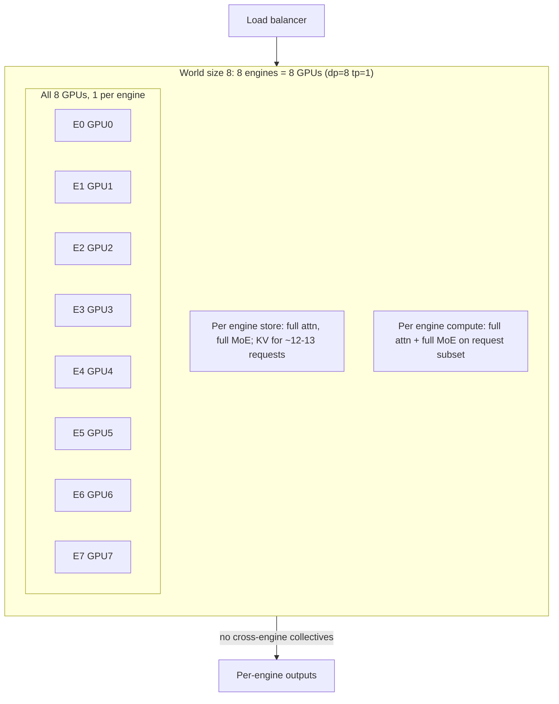
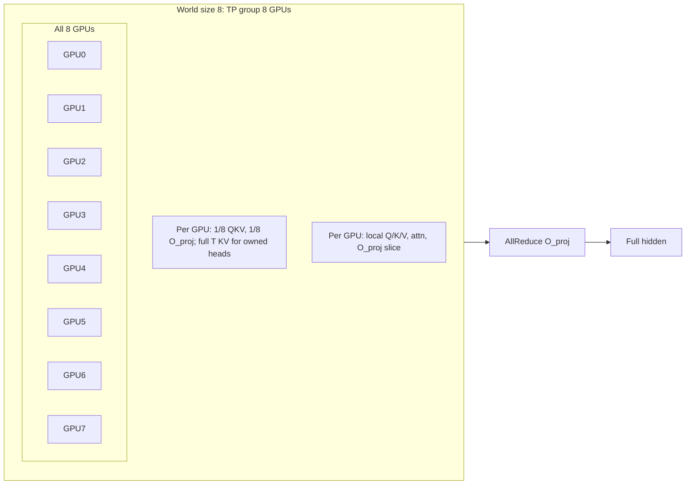
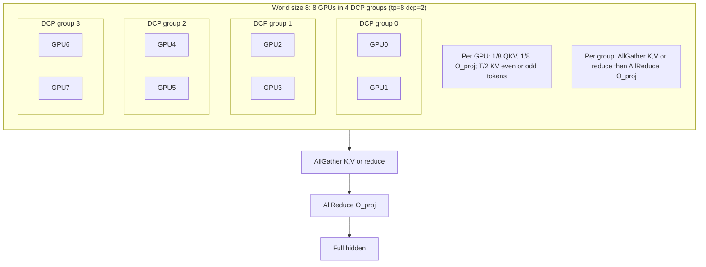

# Attention Sharding: TP, DP, and DCP for Qwen3-235B (World Size 8)

With 8 GPUs and 100 requests of varying length, attention math, storage, and communication differ sharply depending on whether you run **Tensor Parallel (TP)**, **Pure Data Parallel (DP)**, **DP with Expert Parallel (DP+EP)**, or **Decode Context Parallel (DCP)**. This post walks through those differences for **Qwen3-235B-A22B** (4 KV heads, GQA).

Same 8 GPUs, four ways to partition the work. **TP**: one engine, heads split across GPUs, one all-reduce per layer. **Pure DP**: 8 engines, request split, no cross-engine collectives. **DP+EP**: same request split with MoE experts sharded across engines—hidden states move via a2a or AG-RS. **DCP**: same 8 GPUs as TP but KV cache sharded along the sequence; all-gather or reduce over DCP groups, then all-reduce after O_proj.

---

## 1. Terms and notation

| Term | Meaning |
|------|--------|
| **TP** | Tensor Parallel: split weights (e.g. QKV by heads, O by rows); one engine; all-reduce after O_proj. |
| **DP** | Data Parallel: one engine per rank; each engine gets a subset of requests; no cross-engine collectives (unless EP). |
| **DCP** | Decode Context Parallel: KV cache sharded along sequence length T; `dcp_size ≤ tp_size/H`; combines with TP. |
| **EP** | Expert Parallel: MoE experts sharded across DP×TP; needs a2a or AllGather/ReduceScatter to move hidden states. |
| **a2a / AG-RS** | All-to-all or AllGather/ReduceScatter: used in EP to send hidden states to expert shards and get outputs back. |

**Model:** Qwen3-235B-A22B, **H = 4** KV heads. For `tp=8`, without DCP you get 2-way KV replication; with `dcp=2` that duplication is removed.

**World size 8:** Total GPUs = `dp_size × tp_size`. DCP does not add GPUs; it reuses the TP group to shard KV along T.

---

## 2. The Four Strategies at a Glance

| Deployment | Config (example) | Summary |
|------------|-----------------|------------------|
| **TP-only** | `tp=8`, `dp=1`, `dcp=1` | Single engine; 8 GPUs share the model by head-slicing; one all-reduce per layer. |
| **Pure DP** | `tp=1`, `dp=8` or `tp=2`, `dp=4`; no EP | One engine per DP rank; each engine runs full model on its request slice; no cross-engine collectives. |
| **DP+EP** | `dp=8`, `tp=1`, `ep=8` with `--enable-expert-parallel` | Attention as in Pure DP; MoE experts sharded across 8; a2a/AG-RS for hidden states. |
| **DCP** | `tp=8`, `dcp=2` | Same 8 GPUs as TP; KV cache split along T; all-gather/reduce over DCP group, then all-reduce after O_proj. |

**World size and minimum GPUs:**

| Deployment | World size | Minimum GPUs | Note |
|------------|------------|--------------|------|
| TP-only | `tp_size` | 2 if TP used | Single engine. |
| Pure DP | `dp_size × tp_size` | 2 | Need at least 2 engines for request split. |
| DP+EP | `dp_size × tp_size` = EP size | 2 | EP shards experts across all ranks. |
| DCP | `tp_size` (DCP adds no GPUs) | 8 for dcp=2 with H=4 | `dcp_size ≤ tp_size/H`; for Qwen3, dcp=2 ⇒ tp≥8. |

---

## 3. Collectives primer

TP, DCP, and DP+EP each rely on a small set of collective operations to move and combine data across ranks. The following uses **4 nodes** (ranks 0–3) and spells out the math, tensor shapes, and data movement for each collective.

**Notation.** \(B\) = batch, \(T\) = sequence length, \(D\) = hidden size; sharding is along one dimension (e.g. head or hidden) by world size (here 4). **Colors:** blue = rank 0, red = rank 1, green = rank 2, yellow = rank 3; **purple** = reduced (e.g. sum) result. **Labels:** “Before” = shard/rank number (0–3). “After” = **(to-from)**, e.g. (1-0) = from rank 0 to rank 1. If the value is reduced we use purple; if it only moves or is copied, we keep the original color.

#### All-Reduce (AR)

- **Before:** Each node holds one partial value \(s_i\) (e.g. one slice of the O_proj output). Slices differ across nodes.
- **After:** Every node holds the same reduced value (sum over ranks).
- **Shapes:** Before: each node \([B, T, D/4]\). After: every node \([B, T, D]\)—same logical shape, values are the sum across ranks.
- **Math:** \(y_i = s_0 + s_1 + s_2 + s_3\) for all \(i\). Other reductions (min/max) are possible.
- **Where it shows up:** TP output combine (e.g. after RowParallelLinear O_proj); after MoE down_proj when experts are TP-sharded.

**Before (each node has one partial value; label = rank):**

  
N0
0

  
N1
1

  
N2
2

  
N3
3

**After (reduced → purple); (to-node from all):**

  
N0
(0-0123)

  
N1
(1-0123)

  
N2
(2-0123)

  
N3
(3-0123)

#### AllGather (AG)

- **Before:** Each node holds one shard \(s_i\) (e.g. 1/4 of KV).
- **After:** Every node holds the full concatenation \([s_0 \| s_1 \| s_2 \| s_3]\). No arithmetic—replication only.
- **Shapes:** Before: each node \([B, T, D/4]\) (or \([B, H/4, T, d]\) for KV). After: every node \([B, T, D]\) along the sharded dimension.
- **Math:** \(y_i = [s_0 \| s_1 \| s_2 \| s_3]\) for all \(i\).
- **Where it shows up:** DCP gathering full K,V so each rank can run attention; gathering weights or activations elsewhere.

**Before (each node has one shard; label = rank):**

  
N0
0

  
N1
1

  
N2
2

  
N3
3

**After (values unchanged → same colors); (to-from) per shard:**

  
N0

(0-0)

(0-1)

(0-2)

(0-3)

  
N1

(1-0)

(1-1)

(1-2)

(1-3)

  
N2

(2-0)

(2-1)

(2-2)

(2-3)

  
N3

(3-0)

(3-1)

(3-2)

(3-3)

#### ReduceScatter (RS)

- **Before:** Each node holds a full tensor (e.g. full hidden state).
- **After:** Node \(i\) holds only the \(i\)-th chunk of the reduced tensor—the sum of that chunk across all ranks.
- **Shapes:** Before: each node \([B, T, D]\). After: node \(i\) has \([B, T, D/4]\), the \(i\)-th quarter along \(D\), reduced across ranks.
- **Math:** \(y_i = \text{chunk}_i(s_0) + \text{chunk}_i(s_1) + \text{chunk}_i(s_2) + \text{chunk}_i(s_3)\).
- **Where it shows up:** Distributing a reduction so each rank keeps one chunk (e.g. EP or gradient-style layouts).

**Before (each node has full tensor; label = chunk index 0,1,2,3; same color = same rank):**

  
N0

0

1

2

3

  
N1

0

1

2

3

  
N2

0

1

2

3

  
N3

0

1

2

3

**After (reduced → purple); (to-node from all):**

  
N0
(0-0123)

  
N1
(1-0123)

  
N2
(2-0123)

  
N3
(3-0123)

#### All-to-All (A2A)

- **Before:** Node \(i\) holds 4 shards (one per destination): shard for rank 0, 1, 2, 3 (rank-major).
- **After:** Node \(j\) holds the \(j\)-th shard from every rank: \(s_0^{(j)}, s_1^{(j)}, s_2^{(j)}, s_3^{(j)}\) (shard-major). No reduction, only reorder.
- **Shapes:** Before: node \(i\) holds 4 tensors (e.g. tokens routed to each expert rank). After: node \(j\) holds the \(j\)-th shard from every rank; total elements per rank unchanged, layout reordered.
- **Math:** Reorder only. \(y_j = [s_0^{(j)}, s_1^{(j)}, s_2^{(j)}, s_3^{(j)}]\).
- **Where it shows up:** MoE expert parallelism—send tokens to the rank that owns the chosen expert; receive back expert outputs.

**Before (rank-major):** Each node holds 4 shards it will *send* (one per destination). Label = destination shard 0–3. Same color per node = that rank’s data.

  
N0

0

1

2

3

  
N1

0

1

2

3

  
N2

0

1

2

3

  
N3

0

1

2

3

**After (reorder only → same colors); (to-from) per shard:**

  
N0

(0-0)

(0-1)

(0-2)

(0-3)

  
N1

(1-0)

(1-1)

(1-2)

(1-3)

  
N2

(2-0)

(2-1)

(2-2)

(2-3)

  
N3

(3-0)

(3-1)

(3-2)

(3-3)

**Recap (4 nodes).** **AR:** everyone ends up with the same reduced value (sum → purple); per-node shape stays \([B,T,D]\). **AG:** everyone gets the concatenation of all shards; per-node shape goes from \([B,T,D/4]\) to \([B,T,D]\). **RS:** everyone keeps one chunk of the reduced tensor (purple per chunk); \([B,T,D]\) → \([B,T,D/4]\) per node. **A2A:** reorder from rank-major to shard-major; no reduction; total size per rank unchanged.

```mermaid
flowchart TB
    subgraph ar["AR: 4 nodes s0..s3"]
        AR_b[s0 s1 s2 s3] --> AR_op["sum"]
        AR_op --> AR_a["all have sum"]
    end
    subgraph ag["AG: 4 nodes one shard each"]
        AG_b["s0 s1 s2 s3 shards"] --> AG_op["concat"]
        AG_op --> AG_a["all have full"]
    end
    subgraph rs["RS: 4 nodes full tensor"]
        RS_b["full each"] --> RS_op["reduce-scatter"]
        RS_op --> RS_a["node i has chunk_i of sum"]
    end
    subgraph a2a["A2A: rank-major"]
        A2A_b["my shards to 0,1,2,3"] --> A2A_op["reorder"]
        A2A_op --> A2A_a["shard-major: all shards for me"]
    end
```

---

## 4. Pure DP (e.g. dp=8, no EP)

Each of 8 engines runs a full (or TP-within-engine) model on ~12–13 of the 100 requests; no collectives between engines.

**Setup:** One core engine per DP rank; front-end routes requests over ZMQ. With 8 GPUs: 8 engines × 1 GPU (`tp=1`, `dp=8`) or 4 engines × 2 GPUs (`tp=2`, `dp=4`). No `--enable-expert-parallel`. Each engine has a full model replica (or TP only inside that engine). No cross-engine collectives.

- **Stored per engine:** Full attention (and full MoE or TP-sharded within engine); KV only for this engine’s requests (~12–13 of 100 for dp=8).
- **Computed:** Full attention and full MoE on each engine’s request subset.
- **Combine:** None across engines. Within engine: all-reduce after O_proj (and MoE down_proj) when tp>1.
- **Communications:** ZMQ to front-end; no collectives across DP ranks. Within engine, same as TP when tp>1.

---

## 5. TP-Only (tp=8, dp=1, dcp=1)

One engine of 8 GPUs; attention heads and O_proj split across GPUs; full T per GPU for owned heads; one all-reduce per layer after O_proj.

- **Stored per GPU:** 1/8 of QKV (by heads), 1/8 of O_proj; full sequence T for this rank’s heads (e.g. 2 heads per GPU when tp=8, H=4).
- **Computed:** Local Q/K/V, local attention over owned heads and full T, local O_proj slice; then all-reduce so every GPU has full attention output.
- **Combine:** All-reduce after O_proj (and after MoE down_proj when experts are TP-sharded).
- **Communications:** One all-reduce per layer (attention O_proj and MoE down_proj).

---

## 6. DCP — Decode Context Parallel (tp=8, dcp=2)

Same 8 GPUs as TP, but KV cache is sharded along T; each GPU holds ~T/2 tokens per head. Per step: all-gather (or reduce) over DCP group, then all-reduce after O_proj.

- **Stored per GPU:** Same weights as TP (1/8 QKV, 1/8 O_proj); KV sharded along T (e.g. interleaved: rank 0 has tokens 0,2,4,…, rank 1 has 1,3,5,…). ~T/dcp_size KV per head (dcp=2 ⇒ half of T).
- **Computed:** Local Q/K/V as in TP; partial attention over local K,V slice; then combine (all-gather K,V or reduce partial attention) over DCP group so each rank can produce full attention output.
- **Combine:** All-gather of K/V over DCP group (or reduce of partial outputs); then all-reduce after O_proj within TP.
- **Communications:** All-gather or reduce over each DCP group (tp=8, dcp=2 ⇒ 4 groups of 2 GPUs) each decode step; plus all-reduce after O_proj.

---

## 7. DP Attention (DP+EP) (dp=8, tp=1, ep=8)

Same request split as Pure DP, but MoE experts are sharded across all 8 ranks. Each engine runs full attention on its subset; hidden states then move via a2a or AG-RS so EP MoE and the following layers get the right inputs.

**Setup:** With `--enable-expert-parallel`. Example: 8 engines × 1 GPU (dp=8, tp=1, ep=8). Attention is replicated per engine; MoE experts sharded across EP = DP×TP = 8. Hidden states must be sent to/from expert shards (a2a or AG-RS).

- **Stored per engine:** Full attention weights (or TP-sharded within engine); KV only for this engine’s requests (~12–13 of 100).
- **Computed:** Full attention per engine on its subset; then hidden states go to a2a/AG-RS so EP MoE layers (and next attention) can run on the right ranks.
- **Combine:** Within engine: all-reduce after O_proj when tp>1. Across ranks: a2a or AG-RS for EP MoE (hidden states to expert shards, outputs back).
- **Communications:** ZMQ to front-end; no collectives for attention across engines; a2a or AG-RS for EP MoE; within-engine all-reduce when tp>1.

---

## 8. Comparison: Layer Stack and Attention Math

**Layer order:** input → (norm) → MoE → residual → (norm) → attention (QKV → attn → O) → residual → next layer.

### MoE, Attention, and Norms by Deployment

| Component | TP-only (tp=8) | Pure DP | DP+EP | DCP (tp=8, dcp=2) |
|-----------|----------------|---------|-------|-------------------|
| **MoE** | Experts sharded across 8 GPUs; all-reduce on down_proj. | Full replica per engine (or TP within engine); no cross-engine. | Experts sharded across EP; a2a or AG-RS for hidden states. | Same as TP; experts TP-sharded; all-reduce on down_proj. |
| **Attention** | Column-split QKV, row-split O; all-reduce after O_proj. | Replicated per engine; no cross-engine. | Replicated per engine; after attention, a2a/AG-RS for EP MoE and next layers. | KV T-sharded; all-gather/reduce over DCP; then all-reduce after O_proj. |
| **Norms / residuals** | Local per GPU. | Local per engine. | Local per engine. | Local per GPU. |

### Attention and Collectives (100 Requests, Varying Lengths)

| Deployment | Batch / split | Per-GPU work | Collectives |
|------------|---------------|--------------|-------------|
| **TP** | One batch on 8 GPUs | 1/8 head-dim work; full T for owned heads | One all-reduce per layer (O_proj; MoE down_proj). |
| **Pure DP** | 100 split across 8 engines (~12–13 each) | Full attention on smaller batch per engine | None across engines; within-engine all-reduce when tp>1. |
| **DP+EP** | Same split as Pure DP | Full attention on subset per engine | a2a or AG-RS for EP MoE; within-engine all-reduce when tp>1. |
| **DCP** | Same 100 on 8 GPUs | 1/8 weights, ~T/2 per GPU (dcp=2); then DCP combine + TP all-reduce | DCP all-gather/reduce each step; all-reduce after O_proj. |

---

## 9. Choosing a deployment

- **Pure DP:** Many independent requests; you want simple request-level parallelism and no cross-engine collectives. Good when each engine can hold the full model (or a TP group).
- **TP-only:** Single engine, one big batch; you want to split the model across GPUs and are fine with one all-reduce per layer.
- **DCP:** Same 8 GPUs as TP but long contexts; you want to shard KV along T to reduce per-GPU memory and duplication (e.g. when tp_size > H).
- **DP+EP:** MoE model; you want request split (DP) and expert sharding (EP). Use when you’re willing to pay for a2a/AG-RS to move hidden states.

---

## 10. References and code

- [Data Parallel Deployment](https://docs.vllm.ai/en/latest/serving/data_parallel_deployment/) — DP: replicated attention per rank, independent KV caches, load balancing.
- [Context Parallel Deployment](https://docs.vllm.ai/en/latest/serving/context_parallel_deployment/) — DCP: KV cache sharded along T; `dcp_size in [1, tp_size/H]`; interleaving for growing cache.

**DP in vLLM:** Each DP rank is a core engine; front-end talks to engines over ZMQ. With TP, each engine owns `tp_size` workers ⇒ total GPUs = `dp_size × tp_size`. Pure DP: no EP, no cross-engine collectives. DP+EP: `--enable-expert-parallel`; attention replicated; MoE sharded across EP; a2a or AG-RS for hidden states.

**Code:** `QKVParallelLinear` / `RowParallelLinear` ([vllm/model_executor/layers/linear.py](../../pm-vllm/vllm/model_executor/layers/linear.py)), `get_dcp_local_seq_lens` ([vllm/v1/attention/backends/utils.py](../../pm-vllm/vllm/v1/attention/backends/utils.py)), DCP groups ([vllm/distributed/parallel_state.py](../../pm-vllm/vllm/distributed/parallel_state.py)).
